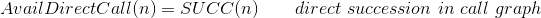
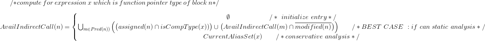
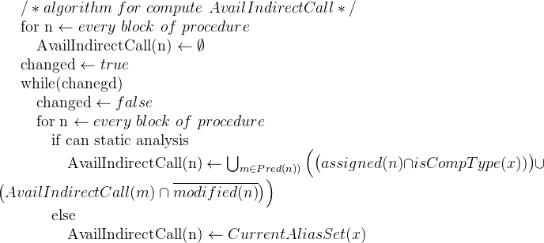

# A efficient algorithm for ARM64 PaX RAP
@(GCC)[GNU System-Security]
        --[zet](https://github.com/fanfuqiang)

## 00 introduction

本文将描述对于目前的PaX RAP的实现的一些优化算法，将会实现为gcc optimization pass。

ROP是一种比较难以防御的攻击，尤其如果没有编译器层面的帮助。PaX RAP是目前工程上可知的最好的实现无论是从性能方面还是工程方面，但是因为PaX RAP的处理过程只是简单地遇到函数类型就计算hash以及进入函数和返回函数比较加密的返回值。所以可以在保留PaX RAP的安全层面代码架构的基础上，添加编译器层面的优化算法。

本文涉及到的算法，总的来说就是在call graph的基础根据function live/type/alias analysis来使合法的目的地址集合更小，以使PaX RAP更加高效和安全。


## 01 algoritms

算法基于PaX RAP安全策略以及GCC代码设计。

因为通过函数指针的调用的存在call graph的构建会涉及到alias analysis，对于C这种极度弱类型的语言来说，pointer alias analysis基本上确定是一个NP问题，所以简单来说本文的算法可以说是基于call graph的type/live flow sensitive inter-procedure alias analysis，inter-procedure alias analysis又回和intra-procedure alias analysis互相共享数据流。

下面给出alias的简化计算框架。

```c
/* The algorithm for compute current alias set for expression x*/

CurrentAliasSet(x)
  build call graph CG/* GCC already have built*/
  
  loop  for every procedure f in CG
      initialize alias set of f
  end loop

  repeat until CG traversed
    loop for every procedure f in CG
      /* 对于每个procedure的block的类型推断为函数指针的表达式x细分计算alias作为intra-procedure alias sets的一部分*/
      using the inter-procedure alias sets compute the intra-procedure alias sets
      using the intra-procedure alias sets update the inter-procedure alias sets
    end loop
    update CG using new function alias
  end repeat
```

计算两个集合：以procedure为粒度的avail集合，保存当前可以使用的procedure，为了从direct call的角度来优化PaX RAP的合法函数集合。另外一个是比较保守的kill集合，针对函数指针，从indirect call角度来优化PaX RAP的合法可间接调用函数集合。

RAP计算函数hash的时候会使用AvailDirectCall()这个集合来为合法的可调用目标计算hash，这里会是一个动态的hash插入。

**TODO** ：
RAP基于type来做hash计算，所以这里的计算会比较复杂。





计算上面availIndirectCall的算法就是根据数据流方程做经典的不动点计算。




## 02 epilogue

本文所描述的算法不是最终版本，所以省略了很多的算法细节，最终版本会更加细化和以工程化性能为第一要素，请参阅过段时间发布代码后的相关的正式版paper。

*live long and prosper.*
